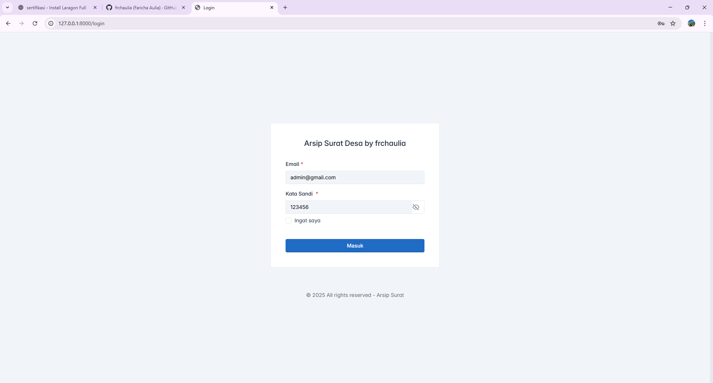

### Intallation Guide
1. Clone the repository:
   ```bash
   git clone repository_url
   ```
2. Navigate to the project directory:
   ```bash
   cd arsip-surat
   ```
3. Install dependencies using Composer:
   ```bash
   composer install
   ```
4. Copy the example environment file and modify the necessary settings:
   ```bash
   cp .env.example .env
   ```
5. Generate an application key:
   ```bash
   php artisan key:generate
   ```
6. Create new database with the name `arsipsurat`.
7. Run database migrations:
   ```bash
   php artisan migrate
   ```
8. Seed the database with initial data:
   ```bash
   php artisan db:seed
   ```
9. Start the development server:
   ```bash
    php artisan serve
    ```
10. Access the application in your web browser at `http://localhost:8000`.
### Default Credentials
- **Email:** admin@example.com
- **Password:** 123456
### Requirements
- PHP >= 8.0
- Composer
- MySQL 

# 📂 Arsip Surat Desa

Aplikasi web berbasis Laravel untuk mengelola arsip surat masuk/keluar pada tingkat desa.  
Didesain agar surat dapat disimpan, dikategorikan, diunduh, dan dikelola dengan mudah.

---

## 🎯 Tujuan
- Membantu perangkat desa dalam mendigitalisasi arsip surat.
- Mempermudah pencarian dan pengelolaan surat berdasarkan kategori.
- Menyediakan akses cepat untuk melihat detail surat dan mengunduh dokumen.

---

## ✨ Fitur Utama
- 🔑 Login & autentikasi admin.
- 📑 Manajemen surat (tambah, ubah, hapus, detail, unduh file PDF).
- 📂 Kategori surat (buat, ubah, hapus).
- 👤 Halaman profil dan tentang pembuat aplikasi.
- 📷 Upload file & preview dokumen.
- ⚡ Tampilan sederhana & responsif.

---

## 🛠️ Cara Menjalankan

1. Clone repository:
  ```bash
   git clone <repository_url>
   cd arsip-surat

2. Install dependency Laravel:
  ```bash
   composer install

3. Salin file environment:
  ```bash
   cp .env.example .env

4. Generate aplikasi key:
  ```bash
   php artisan key:generate

5. Buat database baru dengan nama arsipsurat.

6. Import file arsipsurat.sql ke database, atau jalankan perintah:
  ```bash
   php artisan migrate --seed

7. Jalankan server:
  ```bash
   php artisan serve

8. Akses aplikasi di browser:
  ```bash
   http://127.0.0.1:8000

---

## 🖼️ Dokumentasi Screenshot

### Login & Dashboard
| Login | Dashboard |
|-------|-----------|
|  |  |

### Manajemen Surat
| Kategori | Tambah Surat | Ubah Surat | Detail Surat |
|----------|--------------|------------|--------------|
|  |  |  |  |

### Manajemen Kategori & Hapus
| Tambah Kategori | Ubah Kategori | Tentang | Hapus |
|-----------------|---------------|---------|-------|
|  |  |  |  |

---

## Identitas Pembuat
- Nama: Faricha Aulia
- Program Studi: D4 - Teknik Informatika
- Institusi: Politeknik Negeri Malang
- Tahun: 2025